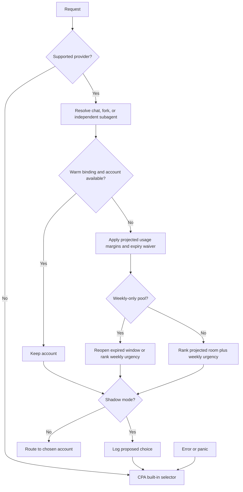

# 🎯 Paced Affinity

<p align="center">
  
</p>

<p align="center">
  <a href="https://github.com/Pandoks/cpa-plugin-paced-affinity/actions/workflows/ci.yml"></a>
  <a href="https://github.com/Pandoks/cpa-plugin-paced-affinity/releases/latest"></a>
  <a href="go.mod"></a>
  <a href="LICENSE"></a>
  <a href="https://github.com/router-for-me/CLIProxyAPI"></a>
</p>

<p align="center">
  <a href="#installation">Install</a> ·
  <a href="docs/how-it-works.md">How it works</a> ·
  <a href="docs/benchmarks.md">Benchmarks</a> ·
  <a href="#faq">FAQ</a>
</p>

Plugin ID: `paced-affinity` · Platforms: linux/amd64, linux/arm64, darwin/arm64 · License: MIT

**Paced Affinity** is a native scheduler plugin for
[CLIProxyAPI (CPA)](https://github.com/router-for-me/CLIProxyAPI). It picks which Claude or Codex
subscription account serves each chat, aiming to get more tokens from the same accounts.

## Why

- Moving a warm Claude main chat rebuilds its cache: about 40× a cached read in our model.
- Equal turns don't mean equal room, especially with mixed subscription sizes.
- Five-hour headroom is little help when the weekly allowance is nearly gone.
- Unused weekly allowance disappears at reset. Spend it while it can still help.

## Features

- **Warm-cache stickiness:** chats stay on their account while the prompt cache is warm.
- **Pacing:** new chats go where the most room is left before each account's next reset.
- **Weekly-expiry awareness:** allowance that would reset unused gets spent first.
- **Subagent-aware:** subagents get their own placement; forks follow their parent.
- **Claude and Codex:** Pro/Max, Plus/Pro/Business, 5-hour and weekly-only plans.
- **Safe by default:** shadow mode, and any error falls back to CPA's built-in selector.

<p align="center"></p>

Each lane runs the same chats through the same accounts under a different routing rule.

## How it works



1. **Stay warm:** keep a chat on its account for a sliding hour; move only if rate-limited.
2. **Place by room:** rank new, idle, or failed-over chats by projected absolute room at reset.
3. **Keep a margin:** stop new chats above 95% projected usage (97% weekly), with an expiry waiver.
4. **Spend before reset:** phase in weekly urgency as pool pace rises from 40% to 70%.
5. **Handle weekly-only Codex:** favor allowance at risk of expiry; reopen expired windows first.
6. **Separate subagents:** give them their own bindings; forks follow the parent.

[The algorithm and worked examples →](docs/how-it-works.md)

## Results

> [!NOTE]
> These are simulations and a real CPA instance against **stubbed accounts**, not real-account
> results. The baseline is CPA round-robin with one-hour session affinity.

| Test bed | Result versus baseline |
| --- | --- |
| Simulation: 112 situations × 30 runs | +0.51% tokens; more in 45, fewer in 0, same in 67 |
| Heavy mixed plans: 16 situations × 30 runs | +0.64% tokens; cache-rebuild waste 1.80% → 1.51% |
| CPA + stubs: three Claude accounts | +2.0% finished requests; −65% failed client attempts |
| CPA + stubs: Codex | Expiring weekly allowance 5.3–7.9% → ≤0.5% |

Gains shrink when every account is exhausted.
[Methodology, full results, and caveats →](docs/benchmarks.md)

## Installation

### Prerequisites

CLIProxyAPI **v8.0.12+** with plugins enabled, on a supported platform. See
[compatibility](#compatibility) before upgrading.

### Plugin store

1. Add this source under `plugins.store-sources` in `config.yaml`, keeping your existing sources.
   CPA's built-in official source stays available.

   ```yaml
   plugins:
     store-sources:
       - https://raw.githubusercontent.com/Pandoks/cpa-plugin-paced-affinity/main/registry.json
   ```

2. Refresh the store in CPA's management panel and install **Paced Affinity**.
3. Merge the [configuration](#configuration) below into the same `plugins` block and restart CPA.
   New and updated libraries load at startup.

### Manual

Download `paced-affinity_<version>_<goos>_<goarch>.zip` and `checksums.txt` from
[Releases](https://github.com/Pandoks/cpa-plugin-paced-affinity/releases).
Choose `linux_amd64`, `linux_arm64`, or `darwin_arm64`. Verify the archive's SHA-256 against
`checksums.txt` (`sha256sum` on Linux; `shasum -a 256` on macOS).

Extract `paced-affinity.so` (`paced-affinity.dylib` on macOS) into
`<plugins.dir>/<goos>/<goarch>/` as a **regular file**; CPA ignores symlinks.
Add the configuration below and restart CPA.

### From source

```sh
git clone https://github.com/Pandoks/cpa-plugin-paced-affinity.git
cd cpa-plugin-paced-affinity
make test
make build
```

Install the library from `dist/` using the manual steps above. See `go.mod` for the Go version.

## Configuration

Merge these settings into `config.yaml`, preserving existing plugin configuration and store sources.

```yaml
plugins:
  enabled: true
  dir: "~/.cli-proxy-api/plugins"
  configs:
    paced-affinity:
      enabled: true
      priority: 1
      shadow: false              # true: log choices; CPA's built-in selector routes
      providers: [claude, codex] # other providers use CPA's built-in selector

routing:
  session-affinity: true
```

| Plugin setting | Value shown | Purpose |
| --- | --- | --- |
| `enabled` | `true` | Enable this scheduler |
| `priority` | `1` | Scheduler priority |
| `shadow` | `false` | Log proposed choices without routing when `true` |
| `providers` | `[claude, codex]` | Providers this scheduler handles |

Set each credential's existing CPA `weight` to its plan multiplier: Claude Max 20x = `20`,
Max 5x = `5`, Pro = `1`; use relative sizes for Codex, such as Pro `24` and Business ProLite `10`.
This is an initial capacity prior, then learned from headers. Keep `routing.session-affinity: true`
so fallback routing stays sticky.

### Check it's working

Use CPA management authentication to request `GET /v0/management/plugins/paced-affinity/status`.
The status path may change between versions; shadow mode also logs proposed decisions.

## Compatibility

Built against **CLIProxyAPI v8.0.12**. Pin your CPA version and upgrade the plugin alongside it;
the minimum version above is not a promise of compatibility with every later release.

> [!IMPORTANT]
> Native plugins run inside CPA with access to credentials. **Paced Affinity** is open source and
> makes no network calls of its own.

## Rollback

Set `plugins.configs.paced-affinity.enabled: false` (or delete the library), then restart CPA.
CPA's built-in selector handles routing.

## FAQ

**Can I try it without changing routing?**

> [!TIP]
> Set `shadow: true` to log proposed decisions while CPA's built-in selector routes requests.

**Do I need exact plan weights?** No. Weights seed relative capacity; observed headers refine it.
Use plan multipliers rather than equal weights for differently sized plans.

**Does it send extra requests?** No. It uses headers, token usage, and session metadata
CPA already sees.

**What if headers are missing?** There is less information to learn from; the plan-weight prior
provides an initial estimate. Errors, panics, and unknown providers fall back to CPA's selector.

**What about Codex Plus/Business with five-hour windows?** They use the five-hour and weekly rules,
like Claude. The weekly-only rule applies to accounts that only have that window.

**Why not just round-robin or fill-first?** Round-robin with affinity is already a strong baseline.
Pacing adds a modest gain around limits and uneven resets; fill-first concentrates pressure and
forces warm-cache moves. See the [comparisons and limits](docs/benchmarks.md).

## License

[MIT](LICENSE).
