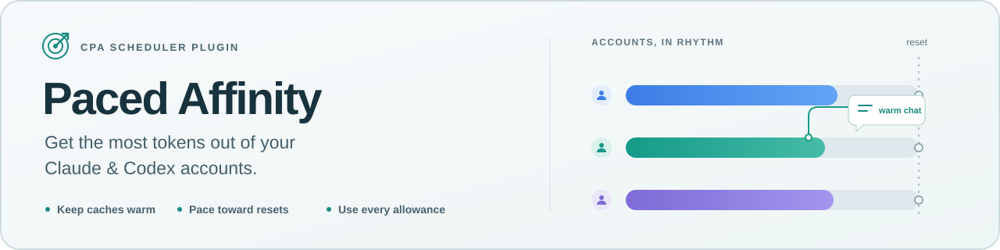
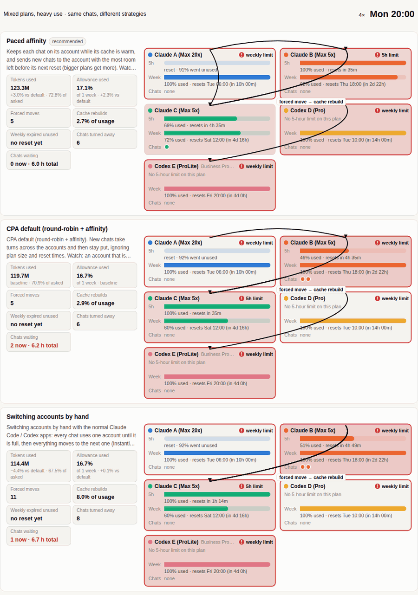
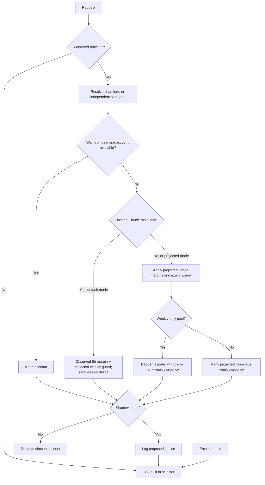

# 🎯 Paced Affinity

<p align="center">
  
</p>

<p align="center">
  <a href="https://github.com/Pandoks/cpa-plugin-paced-affinity/actions/workflows/ci.yml"></a>
  <a href="https://github.com/Pandoks/cpa-plugin-paced-affinity/releases/latest"></a>
  <a href="go.mod"></a>
  <a href="LICENSE"></a>
  <a href="https://github.com/router-for-me/CLIProxyAPI"></a>
</p>

<p align="center">
  <a href="#installation">Install</a> ·
  <a href="docs/how-it-works.md">How it works</a> ·
  <a href="docs/benchmarks.md">Benchmarks</a> ·
  <a href="#faq">FAQ</a>
</p>

Plugin ID: `paced-affinity` · Platforms: linux/amd64, linux/arm64, darwin/arm64 · License: MIT

**Paced Affinity** is a native scheduler plugin for
[CLIProxyAPI (CPA)](https://github.com/router-for-me/CLIProxyAPI). It picks which Claude or Codex
subscription account serves each chat, aiming to get more tokens from the same accounts.

## Why

- Moving a warm Claude main chat rebuilds its cache: about 40× a cached read in our model.
- Equal turns don't mean equal room, especially with mixed subscription sizes.
- Five-hour headroom is little help when the weekly allowance is nearly gone.
- Unused weekly allowance disappears at reset. Spend it while it can still help.

## Features

- **Warm-cache stickiness:** chats stay on their account while the prompt cache is warm.
- **Claude weekly pacing:** new main chats favor accounts behind their weekly spending target,
  using observed five-hour usage for admission.
- **Projected placement:** resumed chats, subagents, failover and Codex keep the original room rule.
- **Weekly-expiry awareness:** allowance that would reset unused gets spent first.
- **Subagent-aware:** subagents get their own placement; forks follow their parent.
- **Claude and Codex:** Pro/Max, Plus/Pro/Business, 5-hour and weekly-only plans.
- **Safe by default:** shadow mode, and any error falls back to CPA's built-in selector.

<p align="center"></p>

Each lane runs the same chats through the same accounts under a different routing rule.
The demo shows the historical projected policy; the default now changes the first placement of
Claude main chats.

## How it works



1. **Stay warm:** keep a chat on its account for a sliding hour; move only if rate-limited.
2. **Pace new Claude main chats:** favor the account furthest behind its elapsed-week target.
3. **Keep a margin:** admit those chats at ≤95% observed five-hour usage; keep the projected
   97% weekly guard and its expiry waiver.
4. **Preserve projected placement:** other placements rank absolute room and allowance at risk of
   expiry; the estimates and burn-rate learning are unchanged.
5. **Handle weekly-only Codex:** favor allowance at risk of expiry; reopen expired windows first.
6. **Separate subagents:** give them their own bindings; forks follow the parent.

[The algorithm and worked examples →](docs/how-it-works.md)

## Results

The current `observed-weekly` rule served more tokens **on average** than the original projected
rule in a replay of recorded chat metadata. The small improvement remains uncertain:

| Pool | Updated rule vs. original, mean [95% interval] | Fresh per-chat manual rules vs. updated plugin |
| --- | ---: | ---: |
| Larger: 4 Claude + 3 Codex accounts | +0.142% [−0.040%, +0.323%] | 2.82–3.36% fewer tokens |
| Smaller: 3 Claude + 2 Codex accounts | +0.238% [−0.206%, +0.683%] | 1.14–1.80% fewer tokens |

The manual comparison checks usage before each new chat, then keeps that account until exhaustion;
it does not switch on every request. These are simulated served tokens, including cached prompts,
not measured live gains. [Follow-up methodology and uncertainty →](docs/benchmarks.md#current-observed-weekly-follow-up)

> [!NOTE]
> The historical results below describe `claude-placement: projected`: simulations and a real CPA
> instance against **stubbed accounts**, not real-account results. The baseline is CPA round-robin
> with one-hour session affinity. They do not measure the new `observed-weekly` default.

| Test bed | Result versus baseline |
| --- | --- |
| Simulation: 112 situations × 30 runs | +0.51% tokens; more in 45, fewer in 0, same in 67 |
| Heavy mixed plans: 16 situations × 30 runs | +0.64% tokens; cache-rebuild waste 1.80% → 1.51% |
| CPA + stubs: three Claude accounts | +2.0% finished requests; −65% failed client attempts |
| CPA + stubs: Codex | Expiring weekly allowance 5.3–7.9% → ≤0.5% |

Gains shrink when every account is exhausted.
[Methodology, full results, and caveats →](docs/benchmarks.md)

## Installation

### Prerequisites

Install and configure [CLIProxyAPI v8.0.12](https://github.com/router-for-me/CLIProxyAPI/tree/v8.0.12)
with your Claude/Codex accounts on linux/amd64, linux/arm64, or darwin/arm64. Its binary must support
native plugins (CGO enabled). See [compatibility](#compatibility) before using another CPA version.

The plugin is a compiled local library loaded by CPA. GitHub source updates
do not automatically update a running CPA instance or publish a release. The store and release
downloads install tagged release artifacts: **v0.1.1 includes the `observed-weekly` default**;
v0.1.0 contains the original projected rule. Use the store/manual steps for a prebuilt release or
[the source installation](#from-source-latest-main-code) for the latest main-branch code.

### Plugin store

1. Add this source under `plugins.store-sources` in `config.yaml`, keeping your existing sources.
   CPA's built-in official source stays available.

   ```yaml
   plugins:
     store-sources:
       - https://raw.githubusercontent.com/Pandoks/cpa-plugin-paced-affinity/main/registry.json
   ```

2. Refresh the store in CPA's management panel and install **Paced Affinity**.
3. Merge the [configuration](#configuration) below into the same `plugins` block and restart CPA.
   Restart after installing or updating to verify the intended library is loaded.

### Manual

Download `paced-affinity_<version>_<goos>_<goarch>.zip` and `checksums.txt` from
[Releases](https://github.com/Pandoks/cpa-plugin-paced-affinity/releases).
Choose `linux_amd64`, `linux_arm64`, or `darwin_arm64`. Verify the archive's SHA-256 against
`checksums.txt` (`sha256sum` on Linux; `shasum -a 256` on macOS).

Extract `paced-affinity.so` (`paced-affinity.dylib` on macOS) into
`<plugins.dir>/<goos>/<goarch>/` as a **regular file**; CPA ignores symlinks.
Add the configuration below and restart CPA.

### From source (latest main code)

Install Git, `make`, a C compiler (GCC/Clang on Linux; Xcode Command Line Tools on macOS), and
Go **1.26.0 or newer**, as declared in `go.mod`. Build on the target machine for its OS/architecture:

```sh
git clone https://github.com/Pandoks/cpa-plugin-paced-affinity.git
cd cpa-plugin-paced-affinity
CGO_ENABLED=1 make test
CGO_ENABLED=1 make build VERSION="$(git rev-parse --short HEAD)"

# Must match plugins.dir in the CPA configuration below, for the user running CPA.
plugin_dir="$HOME/.cli-proxy-api/plugins"
plugin_os="$(go env GOOS)"
plugin_arch="$(go env GOARCH)"
plugin_ext=so
if [ "$plugin_os" = darwin ]; then plugin_ext=dylib; fi
plugin_dest="$plugin_dir/$plugin_os/$plugin_arch"
install -d "$plugin_dest"
install -m 644 "dist/paced-affinity.$plugin_ext" "$plugin_dest/paced-affinity.$plugin_ext.new"
mv -f "$plugin_dest/paced-affinity.$plugin_ext.new" "$plugin_dest/paced-affinity.$plugin_ext"
```

Merge the [configuration](#configuration) into CPA's actual `config.yaml`, restart CPA using the
service manager you installed it with, then [verify the loaded plugin](#check-its-working).
For example, a Linux service named `dev.mise.cli-proxy-api.service` uses
`systemctl --user restart dev.mise.cli-proxy-api.service`; other installations have different
service names or run CPA directly. The staged copy above replaces the regular file without
overwriting an already mapped library. Install the compiled library as a regular file;
CPA ignores symlinked library files.

For subsequent source updates, run `git pull --ff-only` from a clean checkout, repeat the test,
build and copy commands, and restart CPA. Same-path file replacement alone does not activate a
new binary in CPA v8.0.12. If switching from a store installation, check the loaded `path` below:
a versioned store file or saved `store.version` pin may take precedence over the unversioned file.
Uninstall the store copy through its management panel before installing from source, or update
the selected store release instead. Keep older Paced Affinity libraries for rollback outside the
discovery directories; leave other plugins in place.

## Configuration

Merge these settings into `config.yaml`, preserving existing plugin configuration and store sources.

```yaml
plugins:
  enabled: true
  dir: "~/.cli-proxy-api/plugins"
  configs:
    paced-affinity:
      enabled: true
      priority: 1
      shadow: false              # true: log choices; CPA's built-in selector routes
      providers: [claude, codex] # other providers use CPA's built-in selector
      claude-placement: observed-weekly # default; projected restores the original rule

routing:
  session-affinity: true
```

| Plugin setting | Value shown | Purpose |
| --- | --- | --- |
| `enabled` | `true` | Enable this scheduler |
| `priority` | `1` | Scheduler priority |
| `shadow` | `false` | Log proposed choices without routing when `true` |
| `providers` | `[claude, codex]` | Providers this scheduler handles |
| `claude-placement` | `observed-weekly` | First placement of Claude main chats; `projected` restores the original rule |

`claude-placement` accepts only `observed-weekly` and `projected`. It does not change Codex,
warm-cache bindings, forks, subagents or resumed chats with retained usage history. Both modes use
weekly projections; observed usage is not a reservation for future concurrent work.

Set each credential's existing CPA `weight` to its plan multiplier: Claude Max 20x = `20`,
Max 5x = `5`, Pro = `1`; use relative sizes for Codex, such as Pro `24` and Business ProLite `10`.
This is an initial capacity prior, then learned from headers. Keep `routing.session-affinity: true`
so fallback routing stays sticky.

### Check it's working

Use your existing CPA **management key**, not a client API key. Set `CPA_MANAGEMENT_KEY` privately
in your shell and adjust the URL for your installation:

```sh
CPA_URL=http://127.0.0.1:8317
curl --fail --silent --show-error \
  -H "Authorization: Bearer $CPA_MANAGEMENT_KEY" "$CPA_URL/v0/management/plugins"
curl --fail --silent --show-error \
  -H "Authorization: Bearer $CPA_MANAGEMENT_KEY" "$CPA_URL/v0/management/plugins/paced-affinity/config"
curl --fail --silent --show-error \
  -H "Authorization: Bearer $CPA_MANAGEMENT_KEY" "$CPA_URL/v0/management/plugins/paced-affinity/status"
unset CPA_MANAGEMENT_KEY
```

In the list, `paced-affinity` must have `registered: true` and `effective_enabled: true`; inspect
its `path` and `metadata.version` to confirm the library/revision you installed. Configuration must
show `shadow: false` to route requests (`true` only logs proposals). Status must show
`"claude_placement":"observed-weekly"`; an empty account list before any requests is normal.
A missing policy field usually means the original library is still loaded. A 401/403 indicates
management authentication/access, and a 404 may mean management or the plugin is not enabled.
Check CPA startup logs for `pluginhost: plugin loaded` or a loading error.

## Compatibility

Built against **CLIProxyAPI v8.0.12**. Pin your CPA version and upgrade the plugin alongside it;
compatibility with later CPA releases needs verification.

> [!IMPORTANT]
> Native plugins run inside CPA with access to credentials. **Paced Affinity** is open source and
> makes no network calls of its own.

## Rollback

Set `plugins.configs.paced-affinity.claude-placement: projected` to restore the original new-chat
placement rule while retaining the plugin. Reload the plugin configuration through CPA, or restart
CPA if your version requires it.

Set `plugins.configs.paced-affinity.enabled: false` (or delete the library), then restart CPA.
CPA's built-in selector handles routing.

## FAQ

**Can I try it without changing routing?**

> [!TIP]
> Set `shadow: true` to log proposed decisions while CPA's built-in selector routes requests.

**Do I need exact plan weights?** No. Weights seed relative capacity; observed headers refine it.
Use plan multipliers rather than equal weights for differently sized plans.

**Does it send extra requests?** No. It uses headers, token usage, and session metadata
CPA already sees.

**What if headers are missing?** There is less information to learn from; the plan-weight prior
provides an initial estimate. Errors, panics, and unknown providers fall back to CPA's selector.

**What about Codex Plus/Business with five-hour windows?** They use the five-hour and weekly rules,
like Claude. The weekly-only rule applies to accounts that only have that window.

**Why not just round-robin or fill-first?** Round-robin with affinity is already a strong baseline.
Fill-first concentrates pressure and forces warm-cache moves. Historical projected-policy
comparisons and their limits are in [benchmarks](docs/benchmarks.md).

## License

[MIT](LICENSE).
